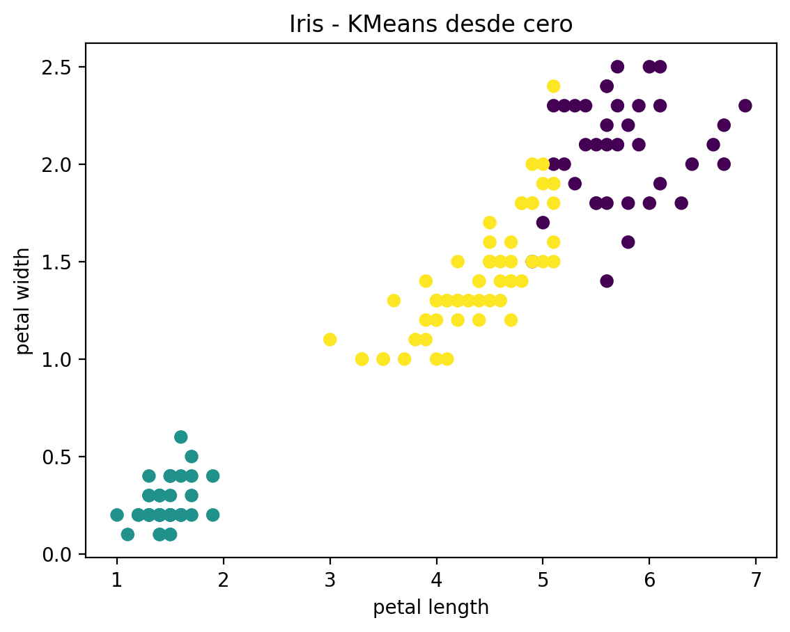
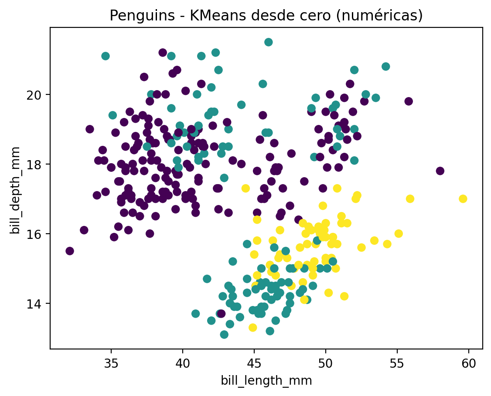
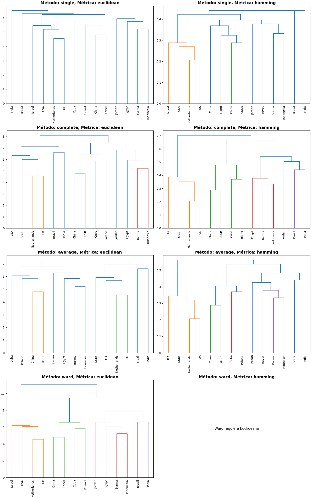
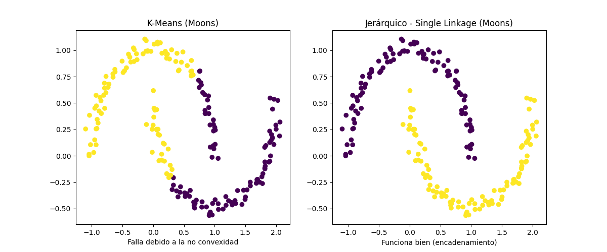

# Informe de Laboratorio 01: Algoritmos de Clustering
**Curso:** Inteligencia Artificial 2026  
**Fecha:** 09/02/2026  
**Integrantes:** Andrés Mazariegos, June Herrera, Dilary Cruz

---

## 1. Implementación de K-Means (Desde Cero)

Se implementó el algoritmo K-Means para vectores en $R^d$ sin utilizar librerías de clustering como sklearn para la lógica principal.

**Función Implementada (`kmeans_basico`):**
```python
def kmeans_basico(X, k, max_iter=200):
    # X: matriz n x d
    X = np.array(X)
    n, d = X.shape

    # 1. Elegimos k puntos aleatorios como centroides iniciales
    indices = np.random.choice(n, k, replace=False)
    centroides = X[indices]

    for _ in range(max_iter):
        # 2. Asignar cada punto al centroide más cercano
        labels = []
        for punto in X:
            distancias = []
            for c in centroides:
                distancia = np.linalg.norm(punto - c)
                distancias.append(distancia)
            labels.append(np.argmin(distancias))
        labels = np.array(labels)

        # 3. Recalcular centroides
        nuevos_centroides = []
        for i in range(k):
            puntos_del_grupo = X[labels == i]
            # Manejo de cluster vacío si ocurriera
            if len(puntos_del_grupo) > 0:
                nuevo_centroide = puntos_del_grupo.mean(axis=0)
            else:
                nuevo_centroide = centroides[i] 
            nuevos_centroides.append(nuevo_centroide)
        nuevos_centroides = np.array(nuevos_centroides)

        # 4. Convergencia
        if np.allclose(centroides, nuevos_centroides):
            break
        centroides = nuevos_centroides

    return labels, centroides
```

---

## 2. Evaluación con Conjuntos de Datos Reales

Se comparó la implementación propia contra la librería `scikit-learn` utilizando el **Adjusted Rand Index (ARI)**, donde 1.0 indica igualdad perfecta y 0.0 solapamiento aleatorio.

### a) Dataset Iris
*   **Resultados:** El algoritmo logró separar perfectamente la clase *Setosa*, con un ligero solapamiento entre *Versicolor* y *Virginica*, comportamiento esperado para K-Means en este dataset.
*   **Comparación con Sklearn:** 
    *   ARI: **1.0000** (Resultados idénticos).



### b) Dataset Penguins
*   **Resultados:** Se utilizaron solo las columnas numéricas.
*   **Comparación con Sklearn:**
    *   ARI: **0.9088** (Resultados alta y consistentemente similares).



### c) Dataset Wine Quality
*   **Resultados:** Se agruparon las propiedades físico-químicas del vino.
*   **Comparación con Sklearn:**
    *   ARI: **0.9974** (Prácticamente idénticos).


**Discusión General:** 
Nuestra implementación produce resultados casi indistinguibles de una librería profesional como `scikit-learn` en estos datasets estándar. Las pequeñas diferencias (cuando existen) se deben principalmente a la inicialización aleatoria de los centroides (`random_state`).

---

## 3. Agrupamiento Jerárquico (Países)

Se aplicaron diferentes métodos (linkage) y métricas sobre el dataset `countries_binary.csv`.

*   **Métodos:** Single, Complete, Average, Ward.
*   **Métricas:** Euclidean, Hamming.

**Resultados (Dendrogramas):**  


*Nota: El método 'Ward' requiere métrica Euclideana.*

---

## 4. Comparación: K-Means vs. Jerárquico (Países)

Se contrastaron los resultados de **K-Means (k=3)** contra **Jerárquico Ward (k=3)** para los datos de países.

**Métrica de Similitud (ARI):** `0.4179`

**Muestra de Comparación:**
| Pais | Cluster KMeans | Cluster Jerárquico (Ward) |
|---|---|---|
| Brazil | 2 | 3 |
| China | 1 | 2 |
| USA | 0 | 1 |
| Cuba | 1 | 2 |

### ¿Son iguales las agrupaciones? ¿Por qué?
**No son iguales.** El índice ARI de ~0.42 indica una coincidencia moderada pero lejana a ser idéntica.
*   **Justificación:** 
    *   **K-Means** intenta minimizar la varianza intra-cluster creando particiones voronoi (tiende a clusters esféricos de tamaño igual) y esta randomizado. 
    *   **Jerárquico (Ward)** construye una estructura de árbol fusionando pares que minimizan el incremento de varianza. Aunque ambos minimizan distancias cuadráticas, la estrategia (divisiva/iterativa vs. aglomerativa) lleva a diferentes óptimos locales, especialmente en datasets pequeños binarios donde la densidad no es uniforme.

---

## 5. Datos Sintéticos (Formas No Convexas)

Se utilizó el dataset `make_moons` (lunas entrelazadas) para poner a prueba los algoritmos.



### (a) ¿Por que k-means falla con formas de “luna”?
K-Means asume que los clusters son **geometrías convexas** (como esferas en 3D o círculos en 2D) definidas por un centroide central. En las formas de "luna", el centroide geométrico de una luna a menudo cae fuera del cluster o cerca del centroide de la otra luna invertida, haciendo imposible separarlas mediante fronteras lineales (diagramas de Voronoi).

### (b) Comparación K-Means vs. Jerárquico
*   **Mejor Resultado:** **Agrupamiento Jerárquico**.
*   **Métrica/Método Funcional:** Método **Single Linkage** (Enlace Simple) con métrica **Euclideana**.
*   **Por qué:** El Single Linkage utiliza la distancia mínima entre puntos de clusters. Esto permite el efecto de "encadenamiento" (*chaining*), donde el algoritmo puede seguir la forma continua y curva de la luna punto a punto, agrupando correctamente estructuras no convexas siempre que haya continuidad en la densidad.

---

## 6. Cuantización de Colores

Se implementó un algoritmo basado en clustering para reducir la paleta de colores de imágenes a **k=4** colores.

**Resultados:**
Se muestra la imagen original, el mapa de clases (a qué cluster pertenece cada pixel) y la imagen reconstruida con los colores promedio de cada cluster.


La cuantización reduce significativamente la información de la imagen manteniendo la estructura general, útil para compresión o efectos artísticos.
